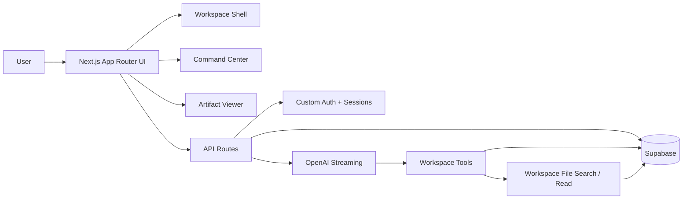

# Canvas

Canvas is a workspace-oriented AI assistant for reading uploaded documents, inspecting structured artifacts, and carrying out real-time conversations inside a project workspace.

It is designed as an **agent workspace**, not a generic chat app:

- the left side of the UI is for files and artifacts,
- the right side is the command center for the AI assistant,
- uploads are extracted into normalized text lines,
- chat responses stream live,
- tool calls are surfaced in the UI so you can see when the agent is reading files or jumping to line ranges.

## What Canvas is for

Canvas helps users:

- create and manage isolated workspaces,
- upload documents into a workspace,
- inspect file contents in a structured viewer,
- chat with an AI agent about the current workspace,
- jump from AI tool usage directly to the referenced file and line range,
- keep a history of conversations per workspace.

The app is especially useful when you want an assistant to reason about project files, uploaded documents, or other workspace artifacts while keeping the interaction organized and auditable.

## Core capabilities

### Workspace management
- Create, list, and delete workspaces.
- Keep conversations scoped to a workspace.
- Maintain workspace state such as selected files, open artifacts, and UI preferences.

### File ingestion and artifact viewing
- Upload files into a workspace.
- Supported file types include:
  - `.txt`
  - `.md`
  - `.csv`
  - `.pdf`
  - `.docx`
- Uploaded files are parsed server-side into normalized text and line arrays.
- CSV files are normalized into a spreadsheet-like artifact view.
- Documents can be opened as tabs inside the artifact viewer.
- The viewer supports line highlighting and automatic scrolling to a referenced range.
- Workspace files can be opened, closed, selected, and deleted.

### AI chat and agent interaction
- Chat with an AI assistant inside the active workspace.
- Responses stream over Server-Sent Events so the UI updates incrementally.
- Conversations are persisted in Supabase.
- The assistant can invoke workspace tools to inspect the loaded files before answering.
- Tool calls and results are exposed in the UI as first-class events.
- Chat history is available per workspace.

### Workspace-level UX controls
- Split-pane layout with draggable resizing on desktop.
- Mobile-friendly workspace/chat tab switcher.
- Workspace settings for:
  - light or dark theme,
  - comfortable or compact density,
  - auto-scroll behavior,
  - line numbers,
  - font size.

## Product structure

Canvas is organized around two major surfaces:

### 1. Artifact workspace
The artifact workspace is the left panel of the main screen. It contains:

- the file explorer,
- open artifact tabs,
- the text/spreadsheet viewer,
- upload entry points,
- file deletion actions,
- highlighted line-range navigation.

### 2. Command center
The command center is the right panel of the main screen. It contains:

- the agent status header,
- the message timeline,
- tool-call cards,
- the composer for sending new messages,
- access to chat history,
- a new-chat action.

## AI agent architecture

Canvas uses a multi-layer agent design.

### Prompt layer
The assistant prompt is stored in `src/prompts/assistant-persona.md` and loaded into the system prompt at runtime. This keeps the assistant’s identity and behavior rules separate from the rest of the application code.

The final system prompt is assembled in `src/lib/chat/system-prompt.ts` and includes workspace behavior rules such as:

- start by listing workspace artifacts when a workspace is available,
- use global search to orient yourself,
- use keyword location to find exact matches,
- use line-range reads for narrow inspection,
- never guess file contents when tools can inspect them directly.

### Tooling layer
Workspace tool definitions live in `src/lib/ai/workspace-tools.ts`.

The current tool set is intentionally read-oriented:

- `list_workspace_artifacts`
- `global_workspace_search`
- `locate_keyword_instances`
- `read_file_segments`

These tools allow the model to orient itself, search across the workspace, and inspect line ranges precisely before responding.

### Execution layer
The model streaming loop lives in `src/lib/chat/openai.ts`.

That layer:

1. builds the message list with system prompt, history, and the current user message,
2. requests a streamed completion from OpenAI,
3. captures token usage and finish reason,
4. collects tool-call deltas when the model requests workspace tools,
5. prepares and runs each tool invocation,
6. emits structured UI events for deltas, tool calls, and results,
7. returns the final assistant message payload and UI message metadata.

### API layer
The chat route (`src/app/api/chat/route.ts`) wraps the agent runtime in an SSE endpoint.

It is responsible for:

- validating the request body,
- checking the session,
- resolving the workspace,
- creating or reusing a conversation,
- storing the user message,
- streaming agent events to the client,
- persisting the assistant response after streaming completes.

### UI layer
The client UI renders the streamed conversation and the workspace viewer side by side.

Tool calls are not hidden inside the model response. Instead, they become visible cards/events that can be clicked to jump into the corresponding artifact and line range.

## System design

Canvas follows a layered architecture with a clear separation of concerns.



### Frontend shell
The main page is `src/app/page.tsx`. It composes the application shell and coordinates:

- active workspace selection,
- open conversations,
- file loading,
- file upload,
- tool-click navigation,
- panel resizing,
- mobile tab switching,
- workspace settings.

The page itself remains an orchestration layer. The heavy UI work is split into focused feature components.

### Feature modules
The UI is broken into feature modules rather than one monolithic page:

- `ArtifactViewer` handles file browsing and document rendering,
- `CommandCenter` handles chat interaction and message streaming,
- `UploadModal` handles file intake and progress,
- `CreateWorkspaceModal` handles workspace creation,
- `ChatHistoryModal` handles conversation history,
- `SettingsModal` handles workspace preferences,
- `Sidebar` handles workspace navigation and controls.

### Data flow
Typical flow for a workspace session:

1. User logs in.
2. The app loads the user’s workspaces.
3. The user selects or creates a workspace.
4. Uploaded files are parsed and stored in Supabase.
5. The artifact viewer turns file rows into openable artifacts.
6. The user sends a prompt.
7. The chat route validates the request, loads history, and starts a streamed OpenAI response.
8. If the model calls a workspace tool, the tool reads from the current workspace data.
9. The UI renders streamed text and tool activity in real time.
10. Conversation messages are persisted for later history access.

## Authentication and session model

Canvas uses a custom authentication flow rather than a third-party auth provider.

### Sign up / sign in
- `src/app/api/auth/register/route.ts` creates users with hashed passwords.
- `src/app/api/auth/login/route.ts` verifies credentials and creates a session.
- `src/app/api/auth/logout/route.ts` clears the session.
- `src/app/api/auth/me/route.ts` returns the current authenticated user.

### Session storage
Sessions are stored in Supabase and tracked with an opaque HTTP-only cookie:

- cookie name: `canvas_session`
- token is hashed before being stored
- sessions expire after 30 days
- session validation happens server-side

This keeps the browser-facing token opaque while still allowing server-side session lookup.

## Data model

The schema is defined in the `sqls/` directory and mirrored by `src/lib/supabase/types.ts`.

### Tables

#### `users`
Stores registered users for the custom auth system.

#### `sessions`
Stores active login sessions as hashed opaque tokens.

#### `workspaces`
Stores workspace records for each user.

#### `conversations`
Stores one chat thread per workspace or conversation context.

#### `messages`
Stores user and assistant messages plus observability metadata:

- finish reason
- prompt token count
- completion token count

#### `workspace_files`
Stores uploaded files and their extracted content:

- original filename
- MIME type
- extension
- byte size
- extracted text
- extracted line array
- line count
- processing status
- optional error message

## File ingestion pipeline

Uploaded files are handled by `src/lib/workspace-files/ingest.ts`.

The ingestion pipeline:

- validates supported file types,
- enforces a maximum file size of 20 MB,
- parses PDF content,
- extracts raw text from DOCX files,
- normalizes CSV input,
- sanitizes text for safe storage and viewing,
- converts content into a line-based structure for artifact navigation.

This line-based format is what makes precise reading and line highlighting possible later in the workspace.

## Search and inspection helpers

Workspace search helpers live in `src/lib/workspace-files/search.ts` and power the read-oriented agent tools.

They support:

- listing workspace artifacts,
- searching across all loaded files,
- locating keyword instances inside a specific file,
- reading exact line segments from a file.

This separation keeps search/inspection logic out of the UI and out of the OpenAI streaming loop.

## Repository structure

```txt
src/
  app/                Next.js App Router pages and API routes
  components/         Feature components and shared UI primitives
  lib/                Server/data/AI/auth/workspace logic
  prompts/            Agent prompt files
  types/              Local ambient type declarations
sqls/                 Supabase schema migrations
public/               Static assets
```

### Notable folders

- `src/app/` — route entry points, login/register pages, and API routes
- `src/components/ArtifactViewer/` — file viewing and artifact navigation
- `src/components/CommandCenter/` — chat thread, tool-call rendering, and composer
- `src/lib/chat/` — prompt assembly, OpenAI streaming, conversation storage
- `src/lib/workspace-files/` — upload ingestion, file client helpers, and search utilities
- `src/lib/auth/` — password hashing and session management
- `src/lib/supabase/` — typed Supabase client and schema types

## Technology stack

- **Next.js 16** — App Router, server routes, and page composition
- **React 19** — client-side interaction and streaming UI
- **TypeScript** — typed data flow across UI, API, and server modules
- **Tailwind CSS v4** — design system and responsive styling
- **Supabase** — persistence for users, sessions, workspaces, files, conversations, and messages
- **OpenAI SDK** — streamed assistant completions and tool calling
- **Zod** — runtime validation for tool inputs and boundary checks
- **Biome** — linting and formatting
- **lucide-react** — iconography

## Configuration

Copy `.env.example` to `.env` and fill in the required values.

### Required server variables

```bash
SUPABASE_URL=
SUPABASE_SECRET=
OPENAI_API_KEY=
```

### Optional server variables

```bash
OPENAI_MODEL=gpt-4o-mini
OPENAI_BASE_URL=
CANVAS_DEFAULT_WORKSPACE_ID=
```

### Notes on Supabase variables

The example env file also includes browser-facing Supabase variables for completeness:

- `SUPABASE_PUBLISHABLE_KEY`
- `NEXT_PUBLIC_SUPABASE_URL`
- `NEXT_PUBLIC_SUPABASE_PUBLISHABLE_KEY`

Those values are documented in `.env.example`, but the current server-side code path primarily relies on `SUPABASE_URL` and `SUPABASE_SECRET`.

## Setup

### 1. Install dependencies

```bash
npm install
```

### 2. Configure environment variables

Create a `.env` file based on `.env.example` and set the required credentials.

### 3. Apply the database schema

Run the SQL files in order:

1. `sqls/001_initial_schema.sql`
2. `sqls/002_workspace_files.sql`
3. `sqls/003_auth_schema.sql`

### 4. Run the app locally

```bash
npm run dev
```

Then open the local development URL shown by Next.js.

## Available scripts

```bash
npm run dev     # start the development server
npm run build   # build the production app
npm run start   # start the production server
npm run lint    # run biome checks
npm run format  # format the codebase with Biome
```

## Operational notes

- Chat responses stream over SSE, so the UI updates progressively instead of waiting for a full completion.
- Tool calls are validated before execution, which helps keep file reads and search operations bounded.
- The server environment loader fails fast if required variables are missing.
- Supabase access is centralized through typed repository modules rather than being scattered across the UI.
- The UI is built to work as a split workspace/chat shell on desktop and a tabbed experience on mobile.

## Design intent

The product visual language aims to stay calm and practical:

- light surfaces,
- strong readability,
- restrained shadows,
- rounded cards and panels,
- compact but not sparse layout density,
- mobile-first responsiveness.

## Current scope

Canvas currently focuses on:

- authenticated workspace sessions,
- document ingestion and viewing,
- chat-based analysis,
- tool-assisted file inspection,
- conversation history,
- workspace settings.

It does **not** expose a general-purpose code editor or file writer in the chat toolset at the moment. The agent is primarily read/inspect oriented.

## Contributing / extending

When extending Canvas, keep the architecture boundaries intact:

- keep route files thin,
- move logic into `src/lib/` or focused feature modules,
- validate at API and tool boundaries,
- keep artifact and command-center concerns separate,
- preserve typed data flow from Supabase to UI,
- update the SQL schema and generated types together when the data model changes.

If you add new workspace tools, make sure their input schema is validated and their UI representation is explicit so users can understand what the agent is doing.
